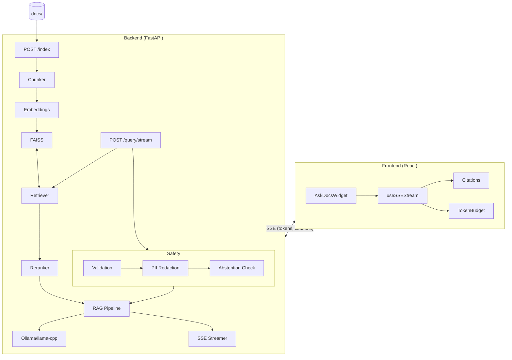

## Ask‑Docs – Local RAG Q&A with Streaming UI

Ask‑Docs is a small end‑to‑end RAG stack:
- **Backend** (`backend/`): FastAPI + FAISS + sentence‑transformers, talking to a **local LLM via Ollama**
- **Frontend** (`frontend/`): React widget that streams answers token‑by‑token
- **Helm chart** (`deploy/helm/ask-docs/`): optional Kubernetes deployment
- **Docker Compose** (`docker-compose.yml`): one‑command local stack

Below is a concrete, copy‑pasteable local setup guide.

---

### Demo Video

[](https://youtu.be/1nQN9yfOONQ)

> Click the image above to watch the full demo on YouTube

---

### Architecture



**Data Flow:**
1. **Indexing**: Documents → Chunking → Embeddings → FAISS Vector Store
2. **Query**: Question → Validation → Retrieval → Reranking → LLM Generation → SSE Streaming

---

### 1. Prerequisites

- Python **3.11+**
- Node.js **18+**
- **Docker** and **docker compose** (for the full stack or Helm testing)
- (Optional but recommended) **Ollama** installed locally: `curl -fsSL https://ollama.com/install.sh | sh`

---

### 2. One‑time project setup (dev mode)

From the repo root:

```bash
# Run the helper script (recommended)
./scripts/setup-dev.sh

# or manually:
python3 -m venv backend/.venv
source backend/.venv/bin/activate
cd backend && pip install -e ".[dev]"
cd ../frontend && npm install
cd ..

# Create data directories (if not already created)
mkdir -p data/index data/cache docs

# Download embedding + reranker models and Ollama model
./scripts/download-models.sh
```

What this does:
- Installs backend & frontend dependencies
- Creates `data/index`, `data/cache`, and `docs`
- Downloads:
  - Embedding model: `all-MiniLM-L6-v2`
  - Reranker model: `cross-encoder/ms-marco-MiniLM-L-6-v2`
  - LLM via Ollama: `llama3.2:3b`

---

### 3. Starting the local LLM (Ollama)

The backend expects a running Ollama server:

```bash
# In a separate terminal
ollama serve

# Make sure the model is pulled (if setup-dev didn’t already do it)
ollama pull llama3.2:3b
```

Environment expectations (already wired via `docker-compose.yml` and config):
- `OLLAMA_HOST` (default: `http://localhost:11434` or the value from compose)
- `OLLAMA_MODEL=llama3.2:3b`

You can override those in your shell or `.env` if needed.

---

### 4. Running backend + frontend in dev

From the repo root:

```bash
# Activate virtualenv first
source backend/.venv/bin/activate

# Start both backend and frontend (parallel)
make dev

# Or individually:
make backend   # FastAPI + RAG API on http://localhost:8000
make frontend  # React widget dev server on http://localhost:5173 (Vite default)
```

Backend entrypoint:
- `backend/app/main.py` (served by Uvicorn, see `Makefile` target `backend`)

Key endpoints:
- `POST /index` – index documents from `./docs` (or a custom path)
- `POST /query` – non‑streaming RAG answer
- `POST /query/stream` – **SSE streaming** answer (used by the widget)
- `GET /health` – basic health

---

### 5. Indexing the sample `docs/` and running end‑to‑end

1. **Put documents into `./docs`**

   Drop PDFs, Markdown, HTML, etc. into the `docs/` folder in the repo root.

2. **Start backend + Ollama**

   ```bash
   # Terminal 1 – LLM
   ollama serve

   # Terminal 2 – API
   source backend/.venv/bin/activate
   make backend  # or make dev to also start the frontend
   ```

3. **Index the docs**

   From the repo root (with backend running):

   ```bash
   # Full index from ./docs, forcing a rebuild
   make index

   # Or manually:
   curl -X POST http://localhost:8000/index \
     -H "Content-Type: application/json" \
     -d '{"force_reindex": true}'
   ```

4. **Run a sample query (sanity check)**

   ```bash
   make query

   # Or manually:
   curl -X POST http://localhost:8000/query \
     -H "Content-Type: application/json" \
     -d '{"question": "What is this project about?", "stream": false}'
   ```

5. **Use the streaming UI**

   - If you ran `make dev`, open the frontend dev URL (e.g. `http://localhost:5173`) or the demo page you’re embedding the widget into.
   - Ask a question: you should see the AI answer **streaming incrementally** via SSE.

---

### 6. Running everything with Docker Compose

From the repo root:

```bash
# Build images and start Ollama, backend, and frontend
make docker-up
```

What this does (see `docker-compose.yml` and `Makefile`):
- Starts:
  - `ollama` on `http://localhost:11434`
  - `backend` on `http://localhost:8000`
  - `frontend` on `http://localhost:5173`
- Waits briefly, then runs:

  ```bash
  docker compose exec ollama ollama pull llama3.2:3b
  ```

Volumes:
- `./docs` → `/app/docs` (read‑only)
- `index-data` → `/app/data/index`
- `cache-data` → `/app/data/cache`

To index docs while running via Docker:

```bash
# Assuming backend is up via docker-up
curl -X POST http://localhost:8000/index \
  -H "Content-Type: application/json" \
  -d '{"force_reindex": true}'
```

Stop everything:

```bash
make docker-down
```

Rebuild images:

```bash
make docker-build
```

---

### 7. Helm chart – Kubernetes deployment (optional)

For a K8s deployment, there is a Helm chart in `deploy/helm/ask-docs/`.

Basic usage (assuming you have a cluster and `helm` configured):

```bash
cd deploy/helm/ask-docs

# Inspect/override values as needed
cat values.yaml

# Install or upgrade
helm upgrade --install ask-docs . \
  --namespace ask-docs --create-namespace
```

You will typically:
- Point the chart at a persistent volume containing your `docs/`
- Configure the Ollama host / model via `values.yaml`
- Expose the frontend service via Ingress or LoadBalancer

---

### 8. Useful Make targets (summary)

From the repo root:

- **Setup**
  - `make setup` – install deps + download models
  - `make install` – install backend + frontend deps only
- **Dev**
  - `make dev` – backend + frontend
  - `make backend` – backend only
  - `make frontend` – frontend only
- **Index & sample**
  - `make index` – index docs from `./docs`
  - `make query` – run a sample query
  - `make sample` – `index` + `query`
  - `./scripts/run_sample.sh` – one-liner to index and query with output
- **Docker**
  - `make docker-up` / `make docker-down` / `make docker-build`
- **Quality**
  - `make test` / `make test-backend` / `make test-frontend`
  - `make lint` / `make format`

This should be enough to go from a clean clone to a **streaming, local‑LLM‑powered docs Q&A** in a few commands.

